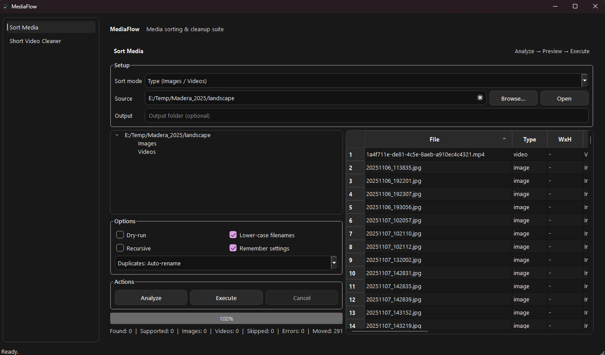

<div align="center">


# MediaFlow

**Media sorting & cleanup suite (Windows, PyQt6)**  
Sort media into clean folder structures and remove short videos safely — built for fast workflows.

</div>

---



## Features

### Sort Media
- **Two modes**
  - **Orientation**: `portrait` / `landscape` *(requires OpenCV)*
  - **Type**: `Images` / `Videos`
- **Analyze → Preview → Execute** workflow
- **Duplicates policy**: Auto-rename / Skip / Overwrite
- Optional: **lower-case filenames**, **recursive scan**, **dry-run**
- Drag & drop folder support

### Short Video Cleaner (Windows)
- Detect videos shorter than a threshold (seconds)
- Actions:
  - Dry-run (no deletion)
  - Move to Recycle Bin (optional)
  - Permanent delete (with confirmation)
- Shows scan results + progress + stats

---

## Requirements

- Python **3.10+**
- Windows recommended (Cleaner is Windows-only)

Install dependencies:
```bash
pip install -U PyQt6
pip install -U opencv-python      # required for Orientation sorting
pip install -U pywin32            # required for Short Video Cleaner (Windows)
pip install -U send2trash         # optional: Recycle Bin action
```

## Package (single EXE)
```powershell
py -m PyInstaller --noconfirm --clean --onefile --windowed `
  --icon assets\MediaFlow.ico `
  --add-data "assets;assets" `
  MediaFlow.py
```
